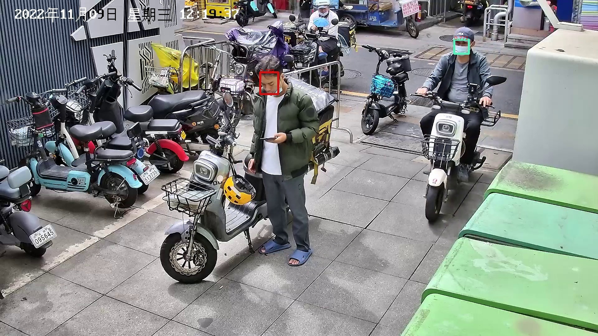

# 人脸识别&车牌识别 SDK 简介

本文说明 人脸&车牌 SDK 和 DEMO 的使用。

## 目录结构

* SDK 目录结构

SDK 包的内容如下：

```
--- [face_recog_lib_rk]
   +--- Makefile
   +--- face_sdk.cpp / face_sdk.h - 人脸识别 SDK 二次封装，使用该封装即可完成图片的人脸检测、特征提取需求
   +--- face_demo.cpp - 基于二次封装的一个 Demo 程序，实现从 ../data/users 目录读取图片并作为底库，再从 ../data/images 读取图片进行人脸检索的功能，检测结果将以图片形式输出到 ../data/images_result 目录
   +--- plate_sdk.cpp / plate_sdk.h - 车牌识别 SDK 二次封装，配置参数针对街景识别
   +--- plate_demo.cpp - 基于二次封装的一个 Demo 程序，实现从 ../data/plates 目录读取图片进行车牌检索及识别的功能，检测结果将以图片形式输出到 ../data/plates_result 目录
   +--- similarity_transform.cpp
   +--- [include] - 人脸/车牌 SDK 的头文件
   +--- [lib64] - 人脸/车牌 SDK 在 AARCH64 上的动态库
   +--- [3rdparty]
      +--- [include] - 需要引入的第三方头文件
      +--- [lib64] - 编译需要的第三方动态库
```

* Demo 目录结构

Demo 包的内容如下，使用时需放在 7G 盒子中的 `/userdata/` 目录下

```
--- [userdata] - /userdata 系统目录
   +-- [face_app]
      +--- [3rdparty] - 执行 Demo 需要的第三方动态库，因为有些 RK 环境下部署的 Buildroot 版本的本地库有部分缺失，因此需在 LD_LIBRARY_PATH 中指定优先使用本目录下的动态库
      +--- [assets] - 人脸&车牌 SDK 的模型文件
      +--- [data]
         +--- [users] - 如前文 face_demo.cpp 介绍，此目录存放人脸底库图片
         +--- [images] - 人脸检测任务图片
         +--- [images_result] - 人脸检测结果
         +--- [plates] - 车牌识别任务图片
         +--- [plates_result] - 车牌识别结果
      +--- [lib] - 人脸 SDK 的动态库
      +--- [bin] - face_demo 可执行程序
         +--- face_demo_license.key - 跟设备绑定的 License
         +--- face_demo
         +--- run_face_demo.sh - 指定 LD_LIBRARY_PATH 并启动 face_demo 的脚本。进入该目录直接执行该脚本，可快速验证人脸检测&识别的 Demo
         +--- plate_demo
         +--- run_plate_demo.sh - 指定 LD_LIBRARY_PATH 并启动 plate_demo 的脚本。进入该目录直接执行该脚本，可快速验证车牌检测&识别的 Demo

```

## SDK 样例

### 人脸检测&识别

对于人脸部分，SDK 提供了以下能力：

1. 人脸检测
1.1 人脸是否带口罩判定
1.2 人脸角度检测
2. 人脸识别
2.1 1:1 识别
2.2 1:N 识别

以闸口戴口罩检测为例，Demo 结果如下图所示：



### 车牌检测&识别

对于车牌部分，SDK 提供了以下能力：

1. 车辆检测
2. 车牌检测（蓝牌、绿牌、黄牌[含双层黄牌]、白牌、黑牌等）
3. 车牌识别

以十字路口灯杆拍摄场景为例，Demo 结果如下图所示：


## 快速验证

将 `face_demo_{date}.tar` 部署到 IoT 设备中的 `/userdata/` 目录下并解压缩，确认 `/userdata/face_app/bin/face_demo_license.key` 是本设备的 License 文件。

进入 `/userdata/face_app/bin/` 目录下，执行 `sh run_face_demo.sh` 脚本，验证人脸检测和识别功能，输出结果包括屏幕日志，及 `/userdata/face_app/data/images_result/` 目录下的图片。

在同一个目录下，执行 `sh run_plate_demo.sh` 脚本，验证车牌检测和识别功能，输出结果包括屏幕日志，及 `/userdata/face_app/data/plates_result/` 目录下的图片。

## 二次开发

### 编译

解压缩 `face_sdk_{date}.tar` 到任意开发目录。

`./face_recog_lib_rk/face_sdk.h/cpp` 对人脸 SDK 进行了二次封装，抽象了较为简单的接口，可参考 `./face_recog_lib_rk/face_demo.cpp` 文件进行二次开发。

`./face_recog_lib_rk/plate_sdk.h/cpp` 对车牌 SDK 进行了二次封装，抽象了较为简单的接口，可参考 `./face_recog_lib_rk/plate_demo.cpp` 文件进行二次开发。


编译时需使用 `./face_recog_lib_rk/3rdparty/lib64` 下的动态库进行链接，可参考 `./face_recog_lib_rk/Makefile`。

需要注意的是，由于 RKMedia 的 RGA 库的限制，输入图片的长、宽需为4的整数倍，否则 `face_sdk.cpp` 中会先调用 OpenCV 的方法（耗费一定时间）对图片进行对齐。同样因为 RK1808 平台上旧版本 RGA 库的限制，输入图片的长、宽不能超过 2000 像素。

### API 

人脸检测及识别功能封装在 `face_sdk.h` 中，由 `class FaceSDK` 提供，具体 API 如下：


* 初始化人脸 SDK

```
/*
 * @params [license_path] - 传入离线 License 文件地址
 */
explicit FaceSDK(const std::string& license_path);
```

* 人脸检测及特征计算

```
/*
 * @params [frame] - OpenCV 的图片矩阵。输入图片长宽若非4的整数倍时，需花费额外时间进行填充操作
 * @params [bigger_face_mode] - True 表示输入为大头照，用于底库建库；False 表示输入为普通照片
 * @params [roi_bbox] - int[4]，分别为 ROI 的左上角、右下角 <x, y>，传入 NULL 表示对全图进行识别
 * @params [face_result] - 返回人脸检测及特征结果
 *
 * @return - 0 表示正常返回，其余为错误
 */
int getFaceFeature(
        const cv::Mat& frame,
        bool bigger_face_mode,
        const int roi_bbox[],
        std::vector<FaceResult>* face_result);

/*
 * @params [file_path] - 图片文件地址，支持 jpg/png 格式。输入图片长宽若非4的整数倍时，需花费额外时间进行填充操作
 * @params [bigger_face_mode] - True 表示输入为大头照，用于底库建库；False 表示输入为普通照片
 * @params [roi_bbox] - int[4]，分别为 ROI 的左上角、右下角 <x, y>，传入 NULL 表示对全图进行识别
 * @params [frame] - 返回读入的图片
 * @params [face_result] - 返回人脸检测及特征结果
 *
 * @return - 0 表示正常返回，其余为错误
 */
int FaceSDK::getFaceFeatureFile(
        const std::string& file_path,
        bool bigger_face_mode,
        const int roi_bbox[],
        cv::Mat* frame,
        std::vector<FaceResult>* face_result);

```

人脸检测及识别功能的返回结果由 `class FaceResult` 表示，人脸检测接口返回 `std::vector<FaceResult>`，其中每个 `FaceResult` 包含两个成员变量 `struct FaceStatus face` 及 `float feature[]`。`face` 包含以下信息:

```
struct FaceStatus {
    float score;        // 人脸的置信度
    int bbox[4];        // 人脸左上角和右下角坐标
    int face_width;
    int face_height;    // 人脸的宽度和高度
    int face_mask;      // 当开启口罩检测时，0 表示佩戴口罩，1 表示未佩戴口罩；-1 表示未检测
    int pitch;          // 人脸绕 x 轴角度
    int yaw;            // 人脸绕 y 轴角度
    int roll;           // 人脸绕 z 轴角度
};
```

`feature` 为长度为 `512` 的 float 数组，为人脸特征向量。`FaceResult` 对象有一个成员方法:

```
/*
 * @param [other] - SDK 返回的人脸检测结果
 *
 * @return - float 表示相似度分数，分数越高表示越相似
 */
float FaceResult::similarity(const FaceResult& other);

```

用于比对两个 `FaceResult` 的人脸相似度。

### SDK 参数设定

针对不同的业务场景，我们给定了不同的推荐参数。

* 人脸门禁机

我们建议输入的图片或检索 ROI 的像素不低于 `320x320`。

我们建议 `FaceSDK` 初始化时的 `FaceDetectParam` （除默认值外）设为：

```
facerecogsdk::FaceDetectParam track_param;
track_param.face_mask_mode = false;
track_param.bigger_face_mode = true;
track_param.need_track_model = false;

```

对返回的人脸过滤条件设置为

```
// 检测结果中的最小人脸（长/宽像素），可修改
#define FRS_MIN_FACE_SIZE 64
// Pitch / Yaw/ Roll 检测阈值，可修改
#define FRS_PITCH_THRESHOLD 20
#define FRS_YAW_THRESHOLD 30
#define FRS_ROLL_THRESHOLD 15

```

* 防疫闸口

对于检测人流是否佩戴口罩的场景，我们建议输入的图片或检索 ROI 的像素不低于 `640x640`。

`FaceSDK` 初始化时的 `FaceDetectParam` 设为：

```
facerecogsdk::FaceDetectParam track_param;
track_param.face_mask_mode = true;
track_param.bigger_face_mode = false;
track_param.need_track_model = false;
track_param.landmark_for_masked_face = false;

```

对返回的人脸过滤条件设置为

```
// 检测结果中的最小人脸（长/宽像素），可修改
#define FRS_MIN_FACE_SIZE 16
// Pitch / Yaw/ Roll 检测阈值，可修改
#define FRS_PITCH_THRESHOLD 40
#define FRS_YAW_THRESHOLD 40
#define FRS_ROLL_THRESHOLD 30
```

对于用户重识别（Re-ID）的场景，我们建议输入的图片或检索 ROI 的像素不低于 `640x640`。

```
facerecogsdk::FaceDetectParam track_param;
track_param.face_mask_mode = true;
track_param.bigger_face_mode = false;
track_param.need_track_model = false;
track_param.landmark_for_masked_face = true;

```

对返回的人脸过滤条件设置为

```
// 检测结果中的最小人脸（长/宽像素），可修改
#define FRS_MIN_FACE_SIZE 64
// Pitch / Yaw/ Roll 检测阈值，可修改
#define FRS_PITCH_THRESHOLD 30
#define FRS_YAW_THRESHOLD 30
#define FRS_ROLL_THRESHOLD 15
```

